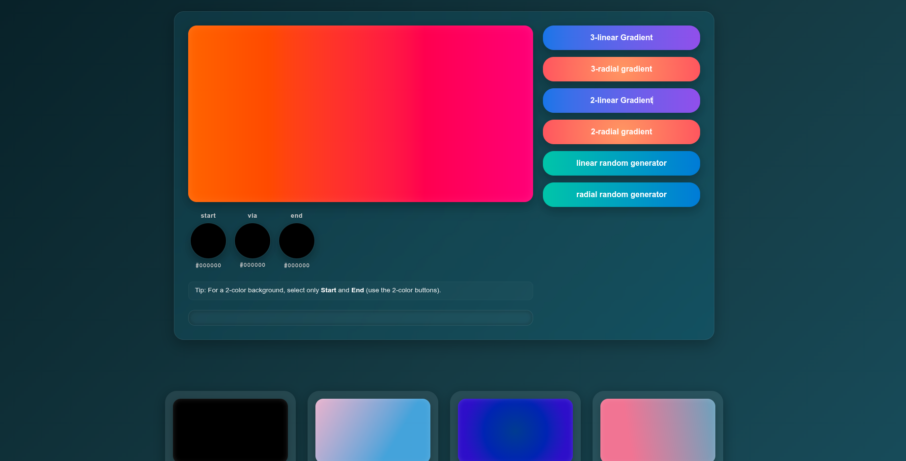

### **Gradient Generator**

This project is a web-based tool for creating, previewing, and saving CSS gradients. It allows users to generate both linear and radial gradients with customizable colors and provides a history of created gradients for easy reference.

---

### **Features**

* **Interactive Gradient Generation**: Create stunning **linear** or **radial** gradients by choosing colors from an intuitive interface.
* **Live Preview**: See a real-time preview of the gradient as you adjust the colors and settings.
* **Save and View History**: Gradients are automatically saved to your browser's **local storage**, allowing you to revisit and use your previous creations even after refreshing the page.
* **Copy to Clipboard**: A simple click copies the generated CSS code for immediate use in your projects.
* **Responsive Design**: The tool is fully responsive and optimized for use on both desktop and mobile devices.

---

### **How to Use**

Simply open the `index.html` file in your web browser. There are no additional configurations or server setups required.

1.  **Customize**: Use the color pickers to select your desired start, middle, and end colors.
2.  **Generate**: Click the "Linear" or "Radial" buttons to generate a new gradient based on your selections.
3.  **Randomize**: Use the "Random" button to generate a brand new gradient with randomly selected colors.
4.  **Save**: The gradients are saved automatically, appearing in the gallery below.
5.  **Copy**: Click on the generated gradient's code block to copy the CSS to your clipboard.

---

### **Requirements**

This project uses plain HTML, CSS, and JavaScript. It runs locally in your browser and does not require any special dependencies, frameworks, or a back-end server.

---

### **Live Preview**

